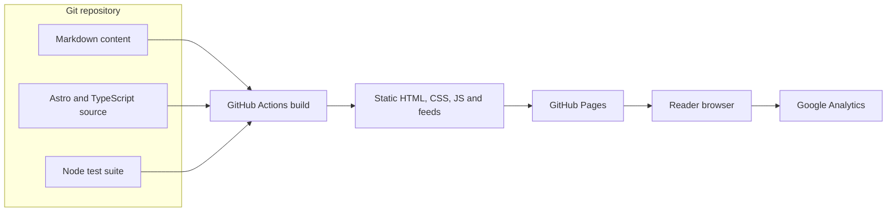

# Container Diagram

- Astro validates the content schema and generates localized post, About, RSS, Atom, sitemap, and 404 outputs.
- GitHub Actions runs the build-backed test suite before uploading the static artifact.
- GitHub Pages serves the artifact; missing legacy tag URLs use the static 404 page.
