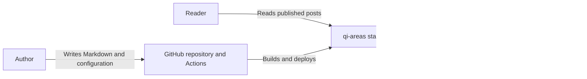

# System Context

The blog publishes multilingual Markdown posts as static pages on GitHub Pages. Readers can browse posts, switch languages, read feeds, and visit the About page. The site has no tag navigation or tag-specific URLs.
