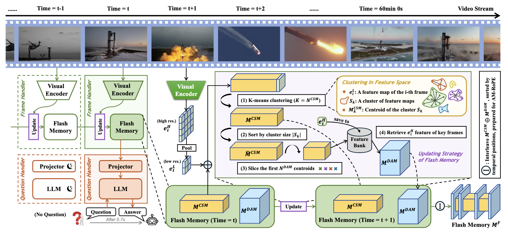

使用了 memory 来提高模型的性能与实时响应能力，在很多 Benchmark 上取得了 SOTA，但作者也表示模型没有针对开放性问题进行优化，有些脱离实际使用场景

## 发现问题

尽管多模态模型取得了进展，但长视频理解仍然面临巨大挑战。主要问题包括：

- 计算与内存开销庞大：长视频的上下文极长，导致显著的计算和 GPU 内存开销，高内存占用限制了其在资源受限的边缘设备上的实际部署。
- 延迟过高，无法实现实时：过高的计算需求会增加推理延迟，直接影响需要实时人机交互的应用。当前的先进模型在对长视频进行问答任务时，往往难以达到实时响应的标准。
- 处理效率低下：现有的大多数工作将长视频与短视频同等对待，没有考虑到视频中普遍存在的时间冗余性，即并非所有视频帧提供的信息都同等重要。

## 解决问题

**双进程异步架构**：将视觉处理和语言处理分离为两个进程以降低推理延迟，帧处理进程在后台持续不断地编码新帧并更新内存；问题处理进程保持在线，一旦接收到用户提问，利用共享内存迅速生成答案，确保 TTFT<1s。

**闪存模块**：核心创新，用于减少连续帧之间的时间冗余，由两个互补的子模块组成：

1. 上下文摘要内存（Context Synopsis Memory, CSM）：用于聚合长周期的上下文时间信息，并通过 K-means 聚类算法将语义相似的帧融合，以此来对视频的信息密度分布进行建模。
1. 细节增强内存（Detail Augmentation Memory, DAM）：由于 CSM 会丢失空间细节，DAM 采用以特征为中心的检索策略，根据 CSM 的分布选择性地检索并存储那些最具信息量的关键帧的高分辨率特征，以增强空间细节。

**自适应多模态旋转位置编码（AM-RoPE）**：改进了原有的位置编码，支持灵活的相对位置嵌入，以适应经过聚类和压缩后的 Memory。比较小的改进。

## 讨论

Flash-VStream 在限制视觉 Token 数量（$N_{Vtokens} \le 12000$）的情况下，成功将 TTFT 控制在 1 秒以内，实现了实时响应，并在同等 Token 成本下大幅超越了其他竞争模型。反过来看，其实也是靠牺牲 Token 数量来提高 Token 效率减少 TTFT。

消融实验证明了 CSM 和 DAM 的效果很好，在固定 Token 预算下，将约 1/3 分配给 CSM 以捕获长期时间信息，2/3 分配给 DAM 以保留空间细节，可达最佳性能。此外，CSM 使用 K-means 聚类算法，以及 DAM 使用基于特征的检索策略，都被证明最优。

## 结论

将帧处理与语言处理分离是比较常见的设计，Memory 的设计值得参考。

Flash-VStream 直接限制视觉 Token 数量以及直接规定 K-means 的种类，也限制了模型的能力。同时跑的 benchmark 也多为多项选择题，在实测中，模型的表现（无法正常对话，偏好回复多项选择题的 ABCD 选项）显示其微调的过拟合了。
