2026-09-25：添加了一些科研笔记，最开始的部分可能有一些错误理解，后面整理一下

Attention sinks现象最早被发现于LLM中，后续被延伸到了Image和Video MLLM中，我们来依次介绍。

## Attention sink

### LLM

首先是LLM中的Attention sink，原论文：Efficient Streaming Language Models with Attention Sinks

**问题**：模型进行多轮对话时，文本长度超过预训练时的文本长度，使用Dense Attention造成模型性能迅速下降

**当前的工作**：

1. 改为Window Attention，持续复用KV，但当文本流的前几个token超出window后，模型的perplexity会暴增

1. 改为Sliding Window，每次都重新计算KV，可以保持perplexity但计算量大

**motivation**：能否既能复用KV，又能保持低perplexity？

**method**：保留前几个attention sink token，再将后续的token换为最新的token，既能复用KV加速计算，又能保持低perplexity，基于此提出StreamingLLM

Attention sink实际上是模型在训练过程中自发产生的一个现象，文章中作者将原因归为某些token不需要从其他token获取信息，但是softmax后的attention score需要和为1，因此最初的几个token由于能被后续所有q看见就被用来吸收多余的attention。作者后续还在实验中发现，这几个attention sink token的语意信息不太重要，替换成几个换行符也没问题。作者还测试了加入一个假的zero sink token来训练，有帮助但没完全解决问题，另一个是加入Learnable Sink Token，效果很好。

另一方面是位置编码，window内的token每次更新时，都要映射回连续的位置编码，否则会存在position gap，并且可能超过模型见过的position范围，所以每次都重新计算了带新位置信息的K，V由于本身就不需要加位置编码所以可以直接复用

Window Attention的perplexity非常高，究其原因是训练和推理不一致，Windows Attention在去除前几个token后，复用KV中attention sink消失了，导致attention被迫流向其他token，和训练时的分布差别过大，导致性能下降，Sliding Window因为每次都重新计算KV所以巧合的保持了attention sink，StreamingLLM保留前几个token，然后复用KV，也保留下来了attention sink，让训练和推理保持一致

### Image MLLM

在非unified multimodal model中，视觉信息的处理流程大致分为两大块：

1. ViT Encoder

1. Decoder

#### ViT Encoder

论文：To Sink or Not to Sink: Visual Information Pathways in Large Vision\-Language Models

ViT Encoder将图片先转为patches，然后再转为和text embedding相同维度的token sequence，这其中也涉及到了attention，所以同样有softmax后的attention score和为1的限制。

但是，ViT Encoder中，使用的是bidirectionnal attention，因此不像LLM中的attention sink多发生在前几个token，ViT Encoder中的attention sink主要发生在high\-norm tokens上，这些token最后可能会承载global representation

#### Decoder

论文：See What You Are Told: Visual Attention Sink in Large Multimodal Models

这篇论文发现decoder阶段有些视觉token会对很多不同query都得到很高的attention，并且有三个特点：

1. 对应的patch不含提问对象

1. 对应的patch位于背景或边缘

1. 删除后不会明显降低模型性能

作者说原因可能是这些token的某些维度数值过大，进而在计算注意力时得分高

文章提出这些sink token可能损坏性能，并提出Visual Attention Redistribution（VAR）来将这些过高的attention重新分配到其他token上，但这个方法仅限于几个image\-centric head，如果直接用到所有head上，会导致性能暴跌，也就是说，在模型容忍的范围内进行重新分布是可行的，但是一旦操作过大，会导致训练推理不一致

从Image MLLM的attention sink工作我们可以得知，某些attention sink token可能承担了全局信息，同时有些token并没有用，是可以被删去的

ViT Encoder中的attention sink token，和Decoder中的attention sink token，是可以相同的

此外，ViT中还有一个register token的概念，专门引入一些token来聚合全局或暂时性的信息，也就是承担了sink token的功能

### Video MLLM

Video MLLM涉及到了temporal，attention sink更为复杂，从单帧视角来看，某个patch可能获取其他patch的高注意，从多帧视角来看，前面帧的某个patch可能持续获得了后面帧patch的高注意

在高效视频理解工作中，很多token会被pruning或者merge，一个直觉的方法是保留高attention的token，但了解过attention sink后，我们可以发现这个直觉是错的，高attention和高semantic并不一定相关，保留过多的attention sink token会挤占真正具有semantic的token空间。在MCQA任务上，可能由于attention sink token上聚合的全局信息，模型还能保持高性能，但在细粒度任务上就无能为力了

Sink\-Token\-Aware Pruning for Fine\-Grained Video Understanding in Efficient Video LLMs中提出Sink\-Token\-aware Pruning，具有高sink tendency的token会被降低保留概率

而在另一个方向上，On the Nature of Attention Sink that Shapes Decoding Strategy in MLLMs中说，attention sink token会包含全局信息，加以利用可以获得性能提升。这篇文章深入到KV分开讨论，做的很前沿，有点没看懂，后面再看看

### 总结

attention sink token主要有三类：

1. 稳定计算：用于吸收多余的softmax attention，需要保留以减少训练推理间的不一致

1. 聚合信息：通过高注意来聚合全局信息，需要preserve or compression or enhance

1. 挤占注意力：有害，需要prune或者redistribute

在高效视频理解中，我们需要压缩token，大致就是要：

1. pruning visual部分只用来吸收多余softmax attention的sink token，将注意力分配到其他semantic token上
1. preserve和问题相关的semantic token
1. merge聚合全局信息的token

## On the Nature of Attention Sink that Shapes Decoding Strategy in Omni-LLMs

论文第一版针对MLLMs，主要研究图像和文本，第二版改成了Omni-LLMs，会同时处理video、audio和text

**问题**：以前的工作通常将attention sink理解为用于吸收多余attention的结构性token，或者将具有sink的attention head视为无效head。但是，如果sink token真的只是在稳定softmax计算，那么直接消除sink attention应该不会损坏模型性能。文章进一步回答：

1. 在omni-llm中如何准确识别sink token

1. 高度attend sink的 attention head，就是redundant head吗？

1. sink token representation是作用于所有token的global signal吗

进一步，提出了OutRo来提高omni-llm在video QA上的性能，并且只有1\.1x 的decoding开销

### Q1：找到sink token

文章比较了两种判定方式：

1. LLM方法：寻找hidden states中的massive activation，也就是数值远大于其他token的异常维度

1. VLM方法：预先确定一些sink dimensions，再判断每个token在这些维度上的归一化数值是否超过阈值

实验发现，VLM方法直接用在omni llm上会出现大量的误判。随着layer加深，大部分token都会被判断成sink，其中甚至包含与问题相关的物体token。原因是这些所谓的sink dimensions与普遍存在的outlier dimensions高度重合，高数值不一定代表token真的承担了sink功能。

相比之下，LLM方法只会找到少量且稳定的sink token。屏蔽这类sink token的关键维度会导致性能崩溃，而屏蔽VLM方法找到的其他token影响很小。因此，文章后续使用LLM方法来识别sink token。

这也说明，在做sink-aware token pruning时，sink token的定义非常重要。如果判定方式本身会把大量semantic token误判成sink，那么后续的pruning或redistribution就失去了意义。

### Q2：高度attend sink的attention head就是redundant head吗？

也并不是

目前的观点认为，由于sink token的v很小，所以即使attention score很大，最终的o还是很小，所以这个头基本没有，基于此，提出可以删去这些redundant head

然而作者通过实验说明，删去高度attend sink的head，既可能出现性能提升，也可能出现性能下跌，所以不能只根据attention score就判断一个head是否有用，还得继续看sink token的KV

### Q3：sink token的representation

作者先看K在看V

sink token中kv的norm都很接近0，但深入到dimension来看，实际上存在一些dimension，他们的值很大

作者假设就是K的这些dimension导致了sink token现象，然后将这些dimension的值清0（称为Zero-K）进行测试，发现sink token上的attention score确实降低了很多，**但是性能也降低了，并且删的dimension越多性能降的越多**，这说明我们不能靠简单的删除或者重新分配attention来提高性能

然后来到V，作者将普通token经过attention layer的输出O拆成来自sink token和其他普通token的两部分

对于来自sink token部分，attention score是普遍较高的，这就是说，这部分会在所有普通token的O中有贡献，这就形成了global bias direction

所以，attention sink可能并不是其他token将没用的attention score放过来，而是所有其他token都需要从这个token获取一个公共的representation

然后作者做了两个实验：

1. 解除sink token的casual mask，让他们吸收更多的context

1. 将non sink token朝着sink token v的方向旋转

结果都获得了性能提升

### OutRo

基于前面的发现，文章提出了一个training-free的inference-time方法OutRo，分为两块：

1. ReLU-tanh gating to align non-sink representations with the sink bias direction

1. sink information enhancement via one-time mask relaxation

#### gated output rotation

这部分就是将non sink token朝着sink token v的方向旋转

首先计算目标方向，先用LLM方法找到sink token，然后计算这些token value的平均值，就得到了sink value direction

然后计算sink value direction和non sink token输出O的cosine similarity，通过ReLU–tanh gate，再计算projection并normalize magnitude，只改变方向，不改变大小

这里还有一个参数是rotation strength，这个参数的大小需要去搜索，并且不同模型得出的参数不同

#### sink information enhancement

这部分很简单，选择一个layer，给所有sink token做mask relaxation，这个layer一般选择模型的1/7 depth

### 实验

实验显示OutRo带来了一些性能提升，但不多，并且有一些开销，作者还试了可以和contrastive decoding一块用

更有意思的是用sink token query去做token pruning，这个实验和前面没有什么太大的关联，也没什么解释，作者假设sink token的q能判断哪些token是有价值的，然后通过attention score去prune掉那些没有价值的token

结果发现，在layer 5保留前20%的token效果最好，性能还有一点提升，layer3反而会掉性能。这里和sink information enhancement中选layer一样，layer过早时，可能还没有形成结构化的信息

但是关于query作者并没有去详细解释，只通过这个实验去验证了一下，value的作用论证的比较充分。整体来看，sink token在query上判断哪些信息值得聚合，在value上将一些signal传播给其他token

对于query的研究可能是后续的方向

## Massive Activations in Large Language Models 2024-02

最早发现massive activations的论文，作者研究的是residual addition结束后的hidden state而不是attention/mlp内部的tensor

某些token：第一个token、`. \n`、and/of，这些没什么语义的词

在某些层：除了最开始和最后几层，往往是在一次layer computation后突然出现的，最后下降消失

某些feature dimension：一般是固定的，非常稀疏

产生了massive activation，比普通activation大了几个数量级

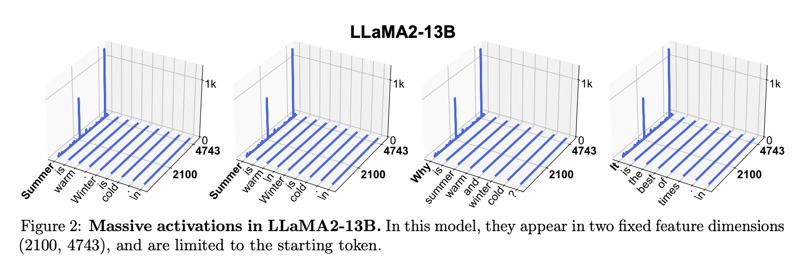

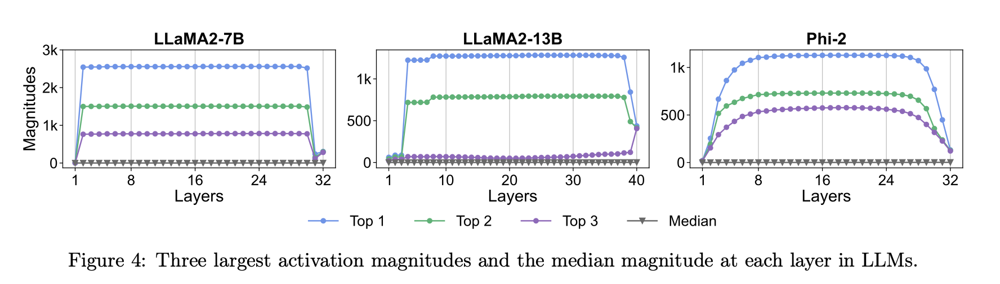

这里要注意，massive activation和outlier feature并不一样，后者指的是某个feature dimension在很多token上都比较大，作者通过实验发现两个定义下找到的token并不重叠

本文给出了一个massive activation的粗略的判断方式：

1. 某个token的某个activation绝对值大于100
1. 某个token的某个activation绝对值大于此层所有activations的中位数的1000倍

二者需要同时满足，作者说了这个不是理论定义，但是能比较稳定的找到massive activation

### massive activations的用处

作者发现，这些massive activations的大小几乎不随着输入x而改变，因此作者认为这很像一个bias

在LLaMA 7b上针对4个massive activation进行了两个实验：

1. 将massive activations设置为0：模型出现了明显的性能降级
1. 将massive activation设置为它们的mean：基本没有区别

然后作者发现，massive activations会带来attention sink。在attention计算过程中，带有massive activation的token得分会略高，然后经过softmax后差距被放大，导致它们吸收了大部分的注意力

现代LLM中一般会使用pre norm+RMSNorm，而RMSNorm对outlier很敏感，收到massive activation影响，非massive activation的feature dimension会被挤压到接近0，导致这个token的feature非常稀疏，并且所有带有massive activations的token都长的差不多。因此，这些带有massive activations的token的representation变成接近固定的，成为了模型学习到的一个隐式的参数

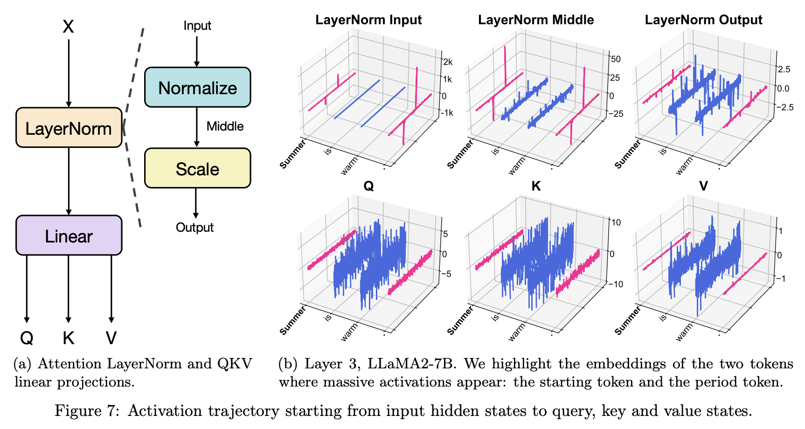

然后作者分解一个token经过attention后的输出，可以单独把来自massive activation token的那部分拿出来，这部分的值近似是固定的，也就成为了一个implicit attention bias。所以26年的最新工作OutRo实际上和这篇工作高度相似，把massive activations包装成了attention sink又拿出来说了一遍

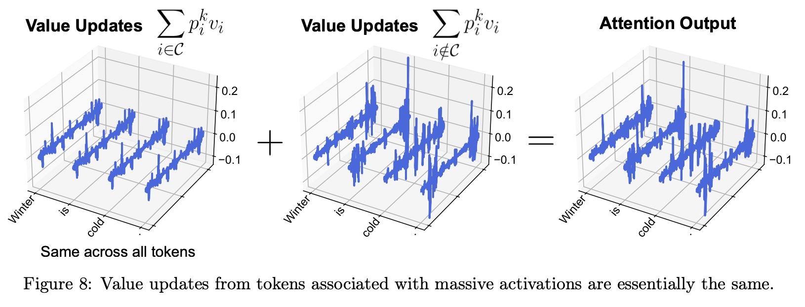

那如果我们显式的加入可学习的KV，用来充当bias呢？作者进行了三组实验：

1. 普通GPT-2：作为对照
1. GPT-2 with [SINK] token：仍然存在massive activations
1. GPT-2 with learnable k,v for each attention head：massive activations消失了，随着layer变深数值平滑提高，并且性能也并没有变化

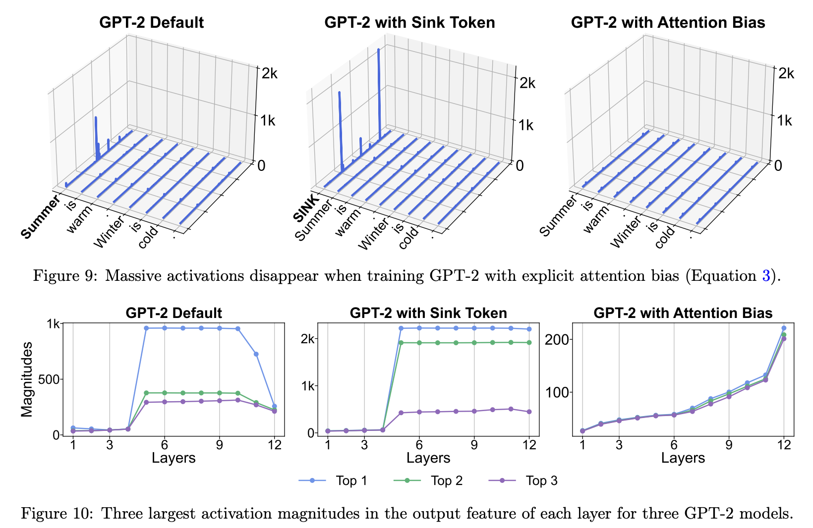

### ViT

然后作者拓展到了ViT中，发现CLIP和DINO中也有，但是MAE中没有，说明massive activations在ViT中并不是普遍现象。

不过ViT中的massive activations和LLM中的有一些区别：

1. 出现的比较晚
1. 发生massive activation的patch token不固定

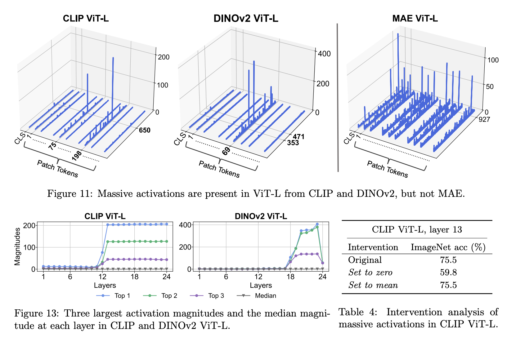

但是功能是相同的，同样是充当bias，上图右下角可以看到实验结果，设置为0会让模型性能降级

之前的ViT工作中，提出过加入register token来聚合global image information以提升性能。作者发现加入register后，所有massive activation都跑到了register 3中，并且最后一层的[CLS]也将attention集中到register 3上，这和LLM中的现象高度一致

然后作者做了一个更强的干预实验，直接将所有register的feature改成了10K ImageNet上的平均值，结果模型性能不变，这说明register本质上提供了constant bias，而非我们预想的global image information

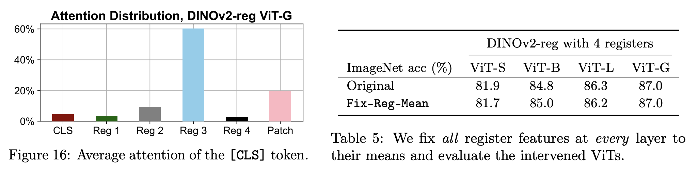

## Active-Dormant Attention Heads 2024-10

实验很复杂，结论比较简单。

1. attention sink的本质是：attention head进入了dormant phase，也就是这个头在当前的输入/任务上基本没用，但是softmax要求attention weights和为1，因此模型会把大部分attention放在一个value很小的token上，使得最终的attention output近似为0
1. attention sink和value-state drain是相关的：某个token的value越小，模型把attention放在它上面就越安全，而attention越集中在它上面，又会进一步推动其value变小，最终系统进入稳定状态，其中不同query对sink token的attention变得很大而且彼此非常接近

## When Attention Sink Emerges in Language Models: An Empirical View 2024-10

直接进入分析部分

从massive activations开始看，作者发现这种token并没有在后续形成很大的key，但是在计算attention的qk点积时，qk的cosine similarity很高，也就产生了attention sink

然后作者还形式化定义了attention sink：后续所有能看到token k的query，平均给它多少attention。然后设定一个阈值来评判

后续对attention sink从何而来的分析就没看了

## See What You Are Told 2025-03

提出Visual Attention Sink

这篇论文主要研究text token到visual token的attention产生的sink

作者首先将获得高attention的visual token分成两类：

1. relevant visual token：和当前text token语义相关
1. irrelevant visual token：固定出现，基本不随text token改变

然后作者发现，irrelevant visual token中也有少数固定的feature dimension异常大，和LLM中的massive activation很像，作者记录下了这些特殊的dimension，然后根据这个现象给出了对visual sink token的定义：

对于一个token x，预先确定一些sink dimensions，再判断每个token的sink dimension数值与RMS(所有维度)的比值是否超过阈值（文章中设置为20）

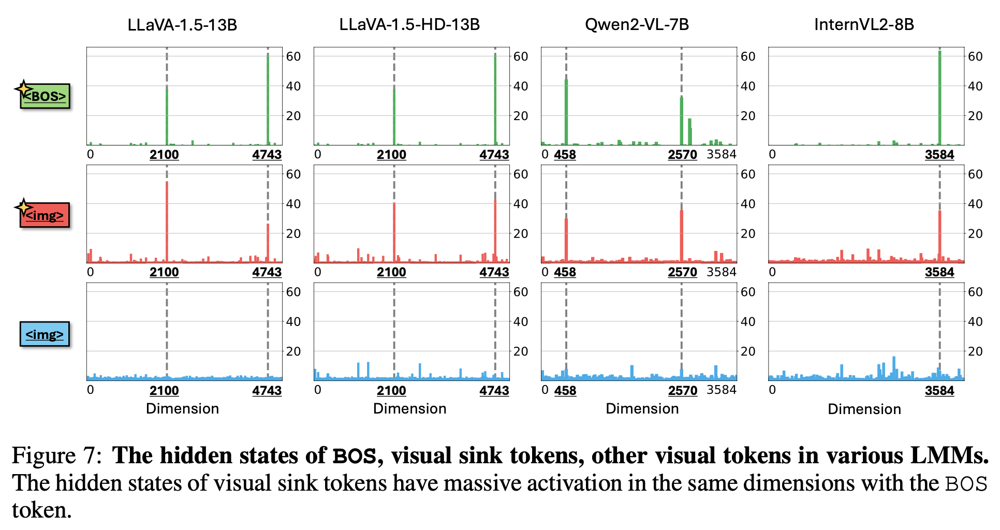

从图中可以看出，这样找出的visual sink token的其他维度还是比较正常的，没有像LLM中一样基本近似为0

作者发现把这些sink token删掉也没有影响，因此就可以把汇聚在这些token上的attention重新分配到其他token上来提高性能表现

## To Sink or Not to Sink 2025-10

作者发现，VLM中的sink现象由两部分组成：

1. ViT传播进来的sink
1. LLM产生的sink

这两类sink的性质不同，不能混为一谈

作者给出了sink的形式化定义：某个异常指标超过阈值的token

而这个异常指标可以有多个定义：

1. feature norm
1. decoding时，输出token对该token的平均attention
1. massive dimension
1. 这里作者没提到，仅看visual token时，还有text token对visual token的平均注意力

然后是作者的选择：

1. ViT sink：使用feature norm
1. LLM sink：使用massive activation

然后进入实验部分，作者发现ViT token norm越大，在LLM中获得的attention越大，ViT并没有规定这个规则，这是LLM自身学会的。并且decoding阶段ViT sink和llm sink获得了差不多的attention。

接着作者发现两种sink的massive dimension并不相同，因此二者确实不是同一种sink

然后做了两个实验来观察ViT sink中到底存了什么：

1. relevance map：**这里用的是ViT中的attention。**观察一个sink token或者non-sink token，找其他token给他的attention来画一张图，发现non-sink token的relevance基本集中在附近局部patches，而sink token的relevance分布在很大范围，并且有的头主要聚合foreground、有的头主要聚合background。也就是说，non-sink token聚合局部信息，sink token聚合粗粒度的全局信息
1. decoding时的word distribution：把attention关了，抑制信息交换，然后看LM Head的distribution输出，发现sink token的distribution明显偏向画面主体，而non-sink token的distribution比较平滑，但是画面主体的frequency仍然很高

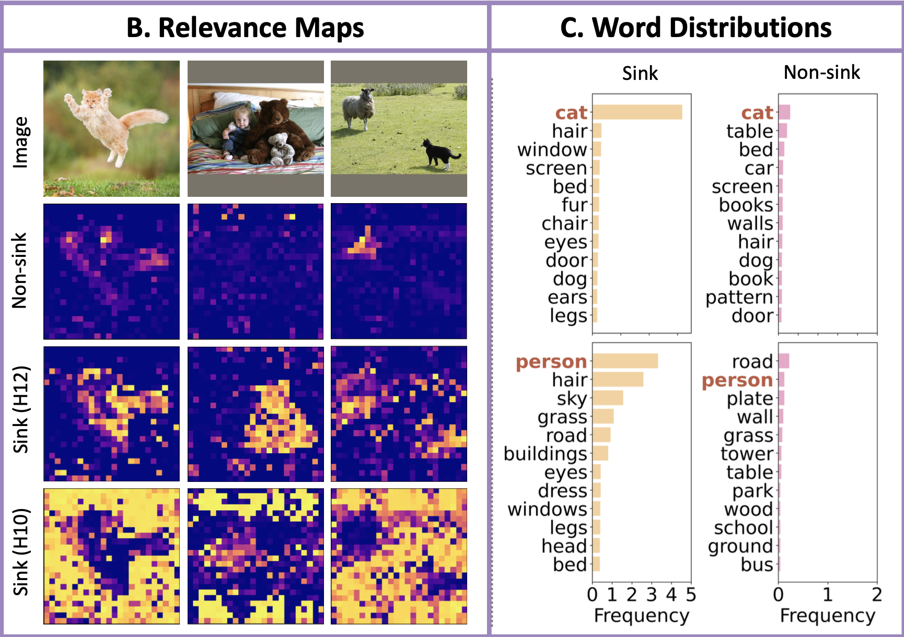

然后又做了一个更激进的实验：

1. 去掉sink token，只保留non-sink token：local tasks提升性能
1. 去掉non-sink token，只保留sink token：global tasks提升性能

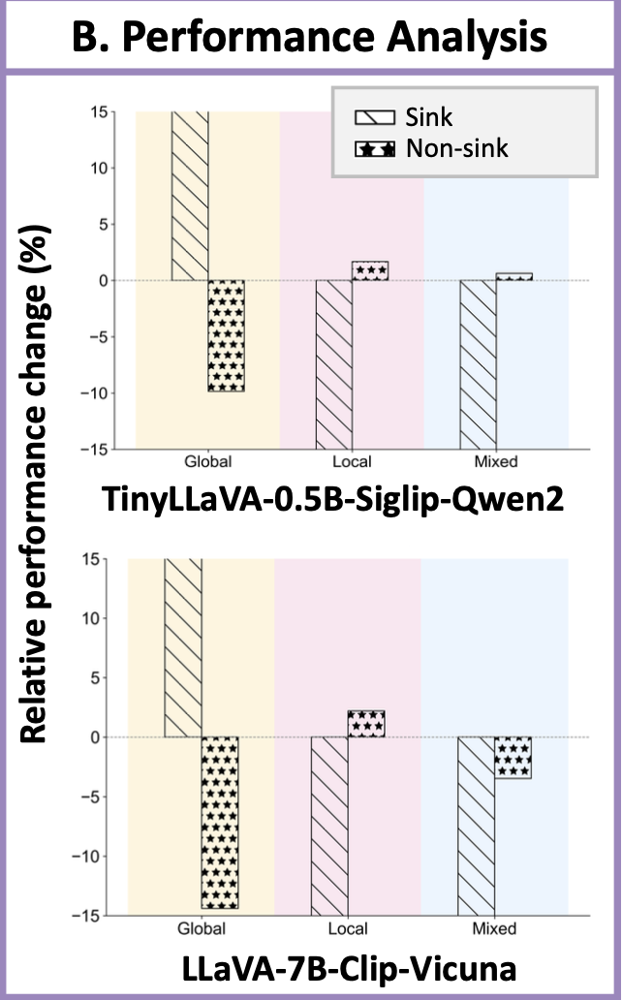

这里可以看到：

1. global任务下，只保留sink token获得了巨大的性能提升，只保留non-sink token则是巨大的性能降级
1. local任务下，只保留sink token是巨大的性能降级，而只保留non-sink token只获得了很小的性能提升
1. mixed任务下，丢弃任意一种token都会有性能下降

### 改进

这里作者提出了两个方法：

1. training-free：Sink-to-the-front，在将visual token放进LLM时，将sink token提前到第一位，同时修改position embedding。这样后续的token能更早的吸收sink token中的全局信息
1. training-based：DIYSink，visual tokens经过projector进入LLM，将这个projector改成dual-mlp，分别处理sink token和non-sink token。接着处理sink token和non-sink token的权重分配问题：
   1. 用CoT让模型自己思考并分配
   1. 再用一个单独的mlp，只根据text tokens来确定sink token和non-sink token的权重，然后直接把权重加权到两类token的feature上

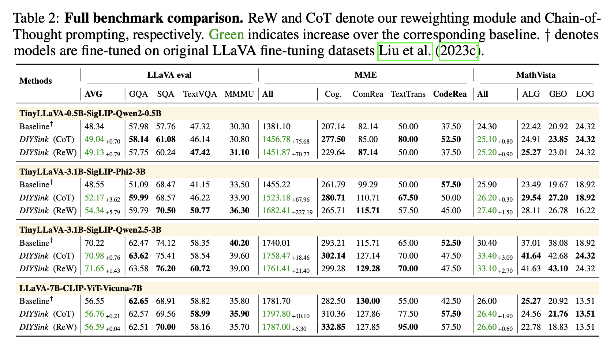

## The Spike, the Sparse and the Sink 2026-03

massive activations -> spike token：residual stream中，少数token的少数channel上出现远超正常的activation。起全局作用，带来一个跨层的隐藏表征，作为模型的隐参数而工作

attention sinks -> sink token：某些token不管重不重要，都会被大量attention head分配异常高的attention mass（第一个token，换行符等等）。起局部作用，更像是一个逐head的gating机制

二者经常同时出现，但这并不是transformer的内在属性，而是特定的模型架构和训练选择决定的

作者得到了3条核心结论：

1. normalization（pre-norm RMSNorm）在massive activations和attention sinks间起到重要作用。但通过修改normalization，可以做到前者消失后者保留
1. attention sink受每个attention head维度以及训练时上下文长度的影响
1. 两者都可以在不损害模型表现的情况下单独消除

### massive activations

1. 只存在于中间层

1. 只存在于少数channel

1. 这些spike channel总是一起spike

1. 不同spike channel的magnitude ratio几乎固定

1. 只发生在少量token

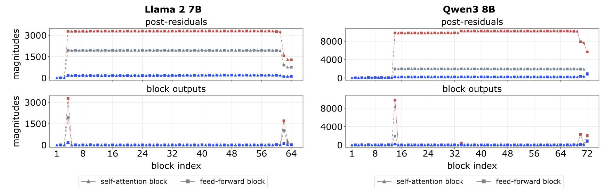

从某一层开始突然产生，通过residual stream传播，到最后突然消失

发现是mlp导致的，它们会把某些特殊的channel放大几个数量级。只有token的representation对准一个特殊方向时才会出发大幅放大

position 0和delimiter token（句号、逗号、换行）很重要，前者是位置影响的，后者是token本身影响的

massive activations作为一个近似常量，主要用于给attention提供一个稳定的reference来形成sink

### attention sink

massive activations经过一个RMSNorm后，由于少数channel有很大的mass，导致产生了一个接近constant的低维数值。当query普遍和这个低维数值的k对齐时，就产生了attention sink

为了形成sink head，模型必须将non-sink key和sink key拉的很开

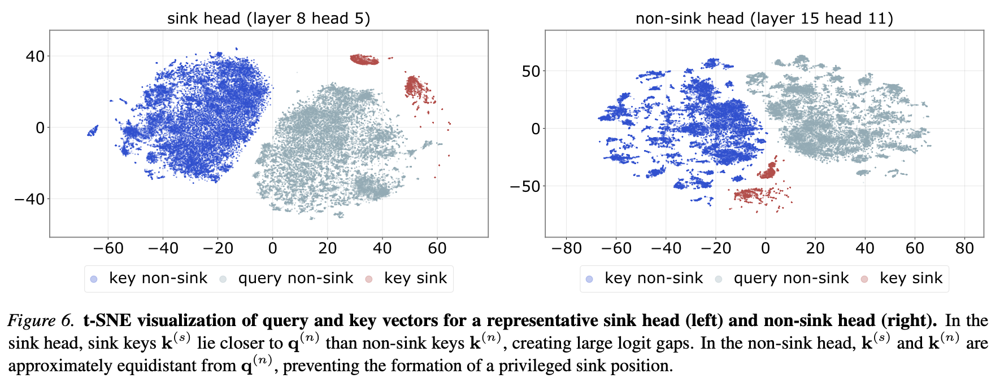

而V又很小，就导致最终的输出接近0，于是attention sink成为模型自发学习出来的隐式gated attention（On the Nature of Attention Sink that Shapes Decoding Strategy in Omni-LLMs又说V是公共表示？？）

最后作者还发现attention sink是否容易形成主要取决两件事：

1. head dimension维度越大，sink key和non-sink key越容易分离
1. 训练时包含大量短context prediction时，模型倾向于只关注附近的上下文，其他注意力就交给sink token来吸收

## When sinks help or hurt 2026-04 ECCV 2026 Oral Spotlight

本文作者主要研究Visual Token，先分类：

1. V-sink：在vision encoder中已经成为sink
1. L-sink：在ViT输出时是普通token，进入LLM后才逐渐变成sink

然后形式化定义什么是sink，这里选择了几个已知的sink dimension，然后直接看token在这些dimension上的值是不是大于某个阈值，判断出V-sink和L-sink后，剩下的token就叫ordinary token

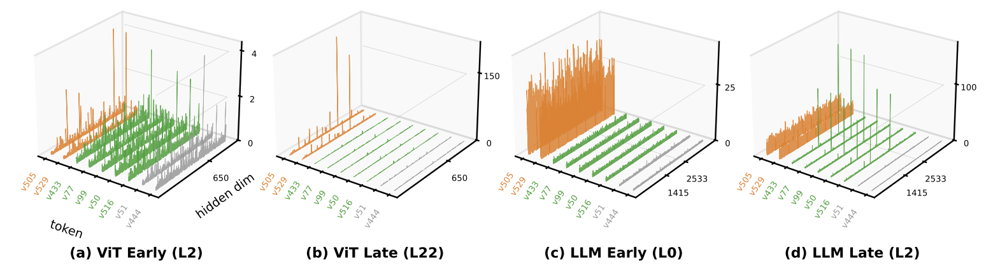

对于V-sink，经过projector后feature发生了混合，而L-sink经过某个mlp后变成了sink token

作者发现二者在hidden-state norm和per-token attention上都很突出，以及二者都携带了global scene summary

然后作者继续做attention干预试验，控制V-sink和rest的attention强度，得到3个观察：

1. sink的好坏和任务有关系：对于细粒度的任务，sink是坏的，对于粗粒度的任务，sink是好的
1. sink的作用还和layer有关：同样的调节，在不同的layer深度上出现了截然不同的效果
1. 把L-sink单独拿出来调节的效果并不大，所以后面的改进中L-sink和Ordinary被划成了一类

### 改进

然后作者提出Layer-wise Sink Gating（LSG）

作者用每层最后一个token的hidden state作为输入，用一个mlp来预测下一层应该多看V-sink还是rest，然后直接NTP

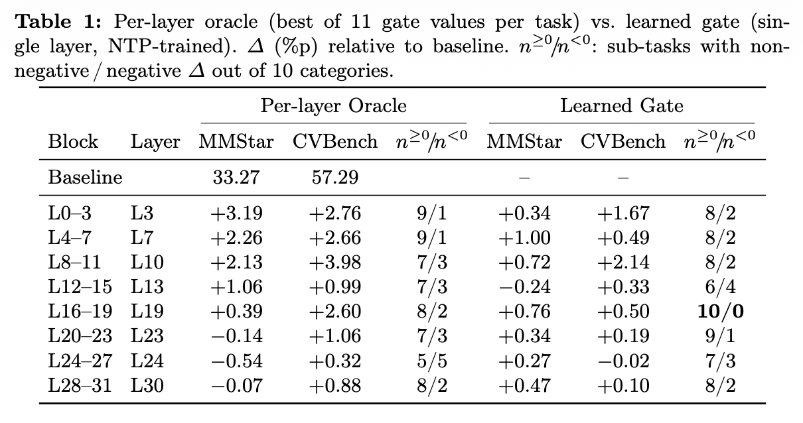

同时在多层使用单独训练的mlp可以叠加增益

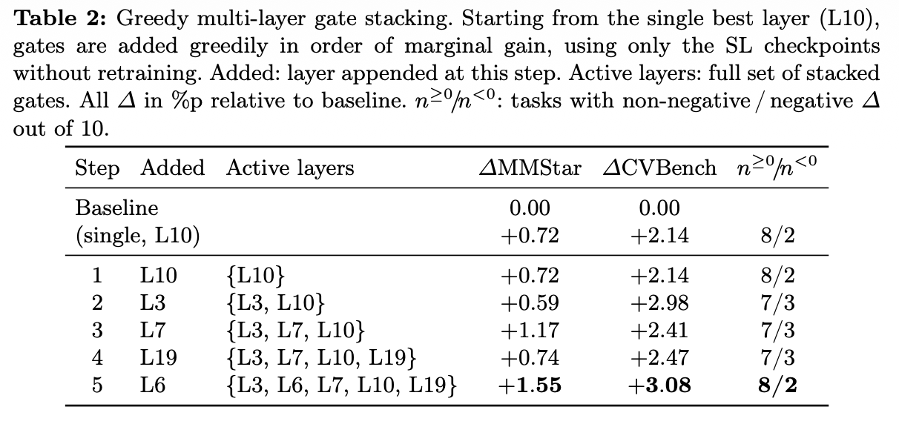

## A Unifying View of Attention Sinks 2026-06

这篇论文发现ViT中存在两种sink：

1. NOP：什么都不做，v norm需要为0
1. Broadcast：广播信息，v正常或较大

所以不能只看attention weight判断sink的作用，还需要看value和residual update

这个工作对attention sink的定义是平均累积注意力大于一个阈值

然后来到实验环节，作者在真实ViT中找到了这两类sink token，浅层和中间层更多的是NOP，深层更多的是Broadcast

然后作者想到之前的工作通过加入几个register token来让模型不要把正常的patch token拿去承担聚合全局信息的工作

然后作者在有register token的模型上继续实验，发现sink mass几乎都迁移到了register上，并且这些register的角色也不同，大部分是NOP，小部分是Broadcast

### 改进

于是作者提出，直接用gating attention取代NOP，然后让register token承担broadcast的功能

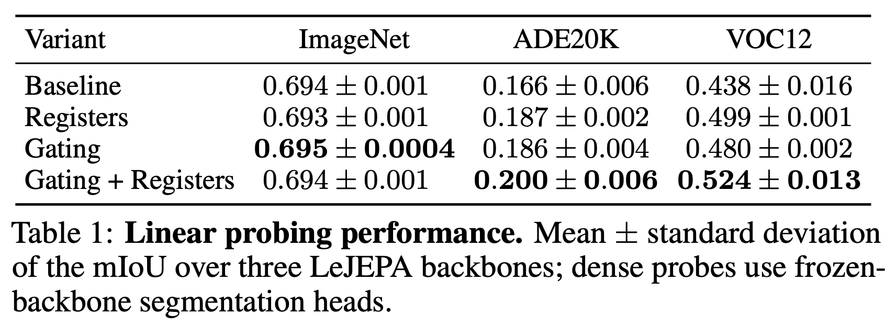

## SinkRouter 2026-04

前面的分析都是研究过的内容，NOP小v norm之类

### 改进

prefilling没动

首先用sink定义，某个query head给BOS的attention大于一个阈值就认为这是NOP的

但是这样工程上没法做，所以改成用query和BOS key的cosine similarity

对于一个KV Group，求多个query的平均大于一个阈值

如果大于了，就直接令attention output为0

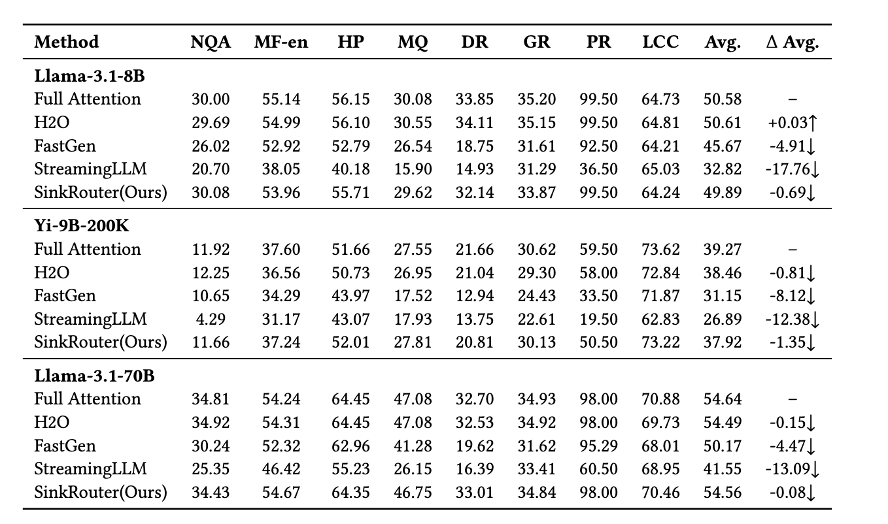

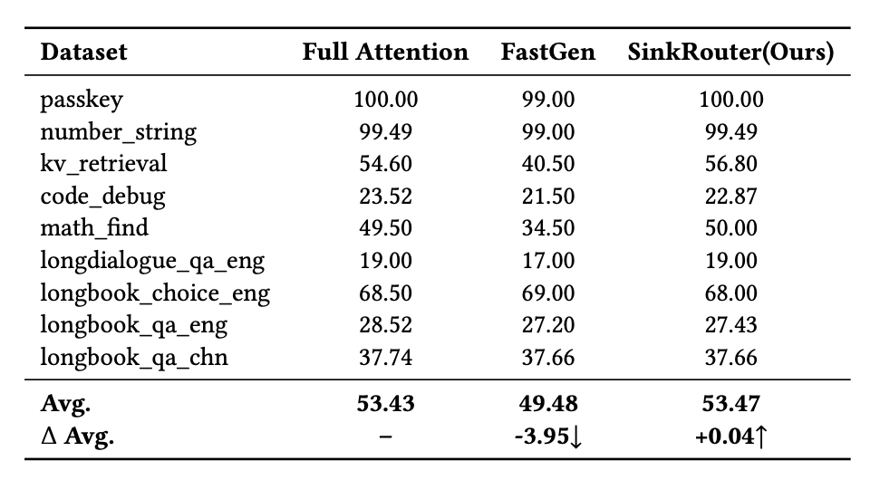

结果是做到了接近无损

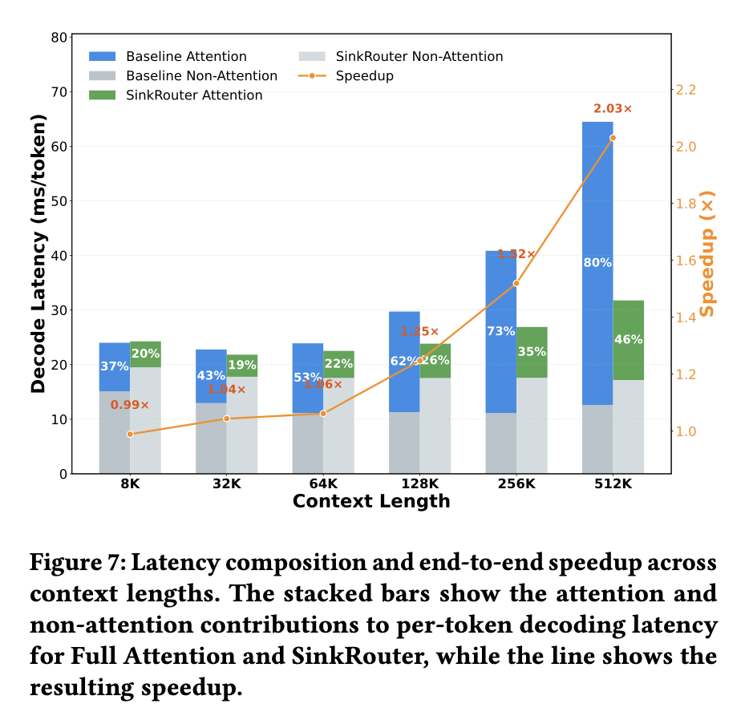

可以看到，上下文越长，加速越明显，但是比较短时基本没啥加速

## 方向

目前有很多工作都研究了attention sink，并且发现了各种各样的作用然后加以利用，但其实它们研究的对象并不相同：

1. 研究的阶段不同：ViT、prefilling、decoding
1. detetor不同，也就是对attention sink的形式化定义不同
   1. attention：某个key/token从许多query接收异常大的softmax attention
   1. massive activations：某个token的少数feature跨数量级的大
   1. high norm：整个token feature vector的范数异常大
1. detector找到的token，还能继续细分，以attention为例
   1. v norm低的，作为NOP
   1. v norm高的，聚合全局信息
