2026-09-25：添加了一些科研笔记，最开始的部分可能有一些错误理解，后面整理一下

Attention sinks 现象最早被发现于 LLM 中，后续被延伸到了 Image 和 Video MLLM 中，我们来依次介绍。

## Attention sink

### LLM

首先是 LLM 中的 Attention sink，原论文：Efficient Streaming Language Models with Attention Sinks

**问题**：模型进行多轮对话时，文本长度超过预训练时的文本长度，使用 Dense Attention 造成模型性能迅速下降

**当前的工作**：

1. 改为 Window Attention，持续复用 KV，但当文本流的前几个 token 超出 window 后，模型的 perplexity 会暴增

1. 改为 Sliding Window，每次都重新计算 KV，可以保持 perplexity 但计算量大

**motivation**：能否既能复用 KV，又能保持低 perplexity？

**method**：保留前几个 attention sink token，再将后续的 token 换为最新的 token，既能复用 KV 加速计算，又能保持低 perplexity，基于此提出 StreamingLLM

Attention sink 实际上是模型在训练过程中自发产生的一个现象，文章中作者将原因归为某些 token 不需要从其他 token 获取信息，但是 softmax 后的 attention score 需要和为 1，因此最初的几个 token 由于能被后续所有 q 看见就被用来吸收多余的 attention。作者后续还在实验中发现，这几个 attention sink token 的语意信息不太重要，替换成几个换行符也没问题。作者还测试了加入一个假的 zero sink token 来训练，有帮助但没完全解决问题，另一个是加入 Learnable Sink Token，效果很好。

另一方面是位置编码，window 内的 token 每次更新时，都要映射回连续的位置编码，否则会存在 position gap，并且可能超过模型见过的 position 范围，所以每次都重新计算了带新位置信息的 K，V 由于本身就不需要加位置编码所以可以直接复用

Window Attention 的 perplexity 非常高，究其原因是训练和推理不一致，Windows Attention 在去除前几个 token 后，复用 KV 中 attention sink 消失了，导致 attention 被迫流向其他 token，和训练时的分布差别过大，导致性能下降，Sliding Window 因为每次都重新计算 KV 所以巧合的保持了 attention sink，StreamingLLM 保留前几个 token，然后复用 KV，也保留下来了 attention sink，让训练和推理保持一致

### Image MLLM

在非 unified multimodal model 中，视觉信息的处理流程大致分为两大块：

1. ViT Encoder

1. Decoder

#### ViT Encoder

论文：To Sink or Not to Sink: Visual Information Pathways in Large Vision\-Language Models

ViT Encoder 将图片先转为 patches，然后再转为和 text embedding 相同维度的 token sequence，这其中也涉及到了 attention，所以同样有 softmax 后的 attention score 和为 1 的限制。

但是，ViT Encoder 中，使用的是 bidirectionnal attention，因此不像 LLM 中的 attention sink 多发生在前几个 token，ViT Encoder 中的 attention sink 主要发生在 high\-norm tokens 上，这些 token 最后可能会承载 global representation

#### Decoder

论文：See What You Are Told: Visual Attention Sink in Large Multimodal Models

这篇论文发现 decoder 阶段有些视觉 token 会对很多不同 query 都得到很高的 attention，并且有三个特点：

1. 对应的 patch 不含提问对象

1. 对应的 patch 位于背景或边缘

1. 删除后不会明显降低模型性能

作者说原因可能是这些 token 的某些维度数值过大，进而在计算注意力时得分高

文章提出这些 sink token 可能损坏性能，并提出 Visual Attention Redistribution（VAR）来将这些过高的 attention 重新分配到其他 token 上，但这个方法仅限于几个 image\-centric head，如果直接用到所有 head 上，会导致性能暴跌，也就是说，在模型容忍的范围内进行重新分布是可行的，但是一旦操作过大，会导致训练推理不一致

从 Image MLLM 的 attention sink 工作我们可以得知，某些 attention sink token 可能承担了全局信息，同时有些 token 并没有用，是可以被删去的

ViT Encoder 中的 attention sink token，和 Decoder 中的 attention sink token，是可以相同的

此外，ViT 中还有一个 register token 的概念，专门引入一些 token 来聚合全局或暂时性的信息，也就是承担了 sink token 的功能

### Video MLLM

Video MLLM 涉及到了 temporal，attention sink 更为复杂，从单帧视角来看，某个 patch 可能获取其他 patch 的高注意，从多帧视角来看，前面帧的某个 patch 可能持续获得了后面帧 patch 的高注意

在高效视频理解工作中，很多 token 会被 pruning 或者 merge，一个直觉的方法是保留高 attention 的 token，但了解过 attention sink 后，我们可以发现这个直觉是错的，高 attention 和高 semantic 并不一定相关，保留过多的 attention sink token 会挤占真正具有 semantic 的 token 空间。在 MCQA 任务上，可能由于 attention sink token 上聚合的全局信息，模型还能保持高性能，但在细粒度任务上就无能为力了

Sink\-Token\-Aware Pruning for Fine\-Grained Video Understanding in Efficient Video LLMs 中提出 Sink\-Token\-aware Pruning，具有高 sink tendency 的 token 会被降低保留概率

而在另一个方向上，On the Nature of Attention Sink that Shapes Decoding Strategy in MLLMs 中说，attention sink token 会包含全局信息，加以利用可以获得性能提升。这篇文章深入到 KV 分开讨论，做的很前沿，有点没看懂，后面再看看

### 总结

attention sink token 主要有三类：

1. 稳定计算：用于吸收多余的 softmax attention，需要保留以减少训练推理间的不一致

1. 聚合信息：通过高注意来聚合全局信息，需要 preserve or compression or enhance

1. 挤占注意力：有害，需要 prune 或者 redistribute

在高效视频理解中，我们需要压缩 token，大致就是要：

1. pruning visual 部分只用来吸收多余 softmax attention 的 sink token，将注意力分配到其他 semantic token 上
1. preserve 和问题相关的 semantic token
1. merge 聚合全局信息的 token

## On the Nature of Attention Sink that Shapes Decoding Strategy in Omni-LLMs

论文第一版针对 MLLMs，主要研究图像和文本，第二版改成了 Omni-LLMs，会同时处理 video、audio 和 text

**问题**：以前的工作通常将 attention sink 理解为用于吸收多余 attention 的结构性 token，或者将具有 sink 的 attention head 视为无效 head。但是，如果 sink token 真的只是在稳定 softmax 计算，那么直接消除 sink attention 应该不会损坏模型性能。文章进一步回答：

1. 在 omni-llm 中如何准确识别 sink token

1. 高度 attend sink 的 attention head，就是 redundant head 吗？

1. sink token representation 是作用于所有 token 的 global signal 吗

进一步，提出了 OutRo 来提高 omni-llm 在 video QA 上的性能，并且只有 1\.1x 的 decoding 开销

### Q1：找到 sink token

文章比较了两种判定方式：

1. LLM 方法：寻找 hidden states 中的 massive activation，也就是数值远大于其他 token 的异常维度

1. VLM 方法：预先确定一些 sink dimensions，再判断每个 token 在这些维度上的归一化数值是否超过阈值

实验发现，VLM 方法直接用在 omni llm 上会出现大量的误判。随着 layer 加深，大部分 token 都会被判断成 sink，其中甚至包含与问题相关的物体 token。原因是这些所谓的 sink dimensions 与普遍存在的 outlier dimensions 高度重合，高数值不一定代表 token 真的承担了 sink 功能。

相比之下，LLM 方法只会找到少量且稳定的 sink token。屏蔽这类 sink token 的关键维度会导致性能崩溃，而屏蔽 VLM 方法找到的其他 token 影响很小。因此，文章后续使用 LLM 方法来识别 sink token。

这也说明，在做 sink-aware token pruning 时，sink token 的定义非常重要。如果判定方式本身会把大量 semantic token 误判成 sink，那么后续的 pruning 或 redistribution 就失去了意义。

### Q2：高度 attend sink 的 attention head 就是 redundant head 吗？

也并不是

目前的观点认为，由于 sink token 的 v 很小，所以即使 attention score 很大，最终的 o 还是很小，所以这个头基本没有，基于此，提出可以删去这些 redundant head

然而作者通过实验说明，删去高度 attend sink 的 head，既可能出现性能提升，也可能出现性能下跌，所以不能只根据 attention score 就判断一个 head 是否有用，还得继续看 sink token 的 KV

### Q3：sink token 的 representation

作者先看 K 在看 V

sink token 中 kv 的 norm 都很接近 0，但深入到 dimension 来看，实际上存在一些 dimension，他们的值很大

作者假设就是 K 的这些 dimension 导致了 sink token 现象，然后将这些 dimension 的值清 0（称为 Zero-K）进行测试，发现 sink token 上的 attention score 确实降低了很多，**但是性能也降低了，并且删的 dimension 越多性能降的越多**，这说明我们不能靠简单的删除或者重新分配 attention 来提高性能

然后来到 V，作者将普通 token 经过 attention layer 的输出 O 拆成来自 sink token 和其他普通 token 的两部分

对于来自 sink token 部分，attention score 是普遍较高的，这就是说，这部分会在所有普通 token 的 O 中有贡献，这就形成了 global bias direction

所以，attention sink 可能并不是其他 token 将没用的 attention score 放过来，而是所有其他 token 都需要从这个 token 获取一个公共的 representation

然后作者做了两个实验：

1. 解除 sink token 的 casual mask，让他们吸收更多的 context

1. 将 non sink token 朝着 sink token v 的方向旋转

结果都获得了性能提升

### OutRo

基于前面的发现，文章提出了一个 training-free 的 inference-time 方法 OutRo，分为两块：

1. ReLU-tanh gating to align non-sink representations with the sink bias direction

1. sink information enhancement via one-time mask relaxation

#### gated output rotation

这部分就是将 non sink token 朝着 sink token v 的方向旋转

首先计算目标方向，先用 LLM 方法找到 sink token，然后计算这些 token value 的平均值，就得到了 sink value direction

然后计算 sink value direction 和 non sink token 输出 O 的 cosine similarity，通过 ReLU–tanh gate，再计算 projection 并 normalize magnitude，只改变方向，不改变大小

这里还有一个参数是 rotation strength，这个参数的大小需要去搜索，并且不同模型得出的参数不同

#### sink information enhancement

这部分很简单，选择一个 layer，给所有 sink token 做 mask relaxation，这个 layer 一般选择模型的 1/7 depth

### 实验

实验显示 OutRo 带来了一些性能提升，但不多，并且有一些开销，作者还试了可以和 contrastive decoding 一块用

更有意思的是用 sink token query 去做 token pruning，这个实验和前面没有什么太大的关联，也没什么解释，作者假设 sink token 的 q 能判断哪些 token 是有价值的，然后通过 attention score 去 prune 掉那些没有价值的 token

结果发现，在 layer 5 保留前 20% 的 token 效果最好，性能还有一点提升，layer3 反而会掉性能。这里和 sink information enhancement 中选 layer 一样，layer 过早时，可能还没有形成结构化的信息

但是关于 query 作者并没有去详细解释，只通过这个实验去验证了一下，value 的作用论证的比较充分。整体来看，sink token 在 query 上判断哪些信息值得聚合，在 value 上将一些 signal 传播给其他 token

对于 query 的研究可能是后续的方向

## Massive Activations in Large Language Models 2024-02

最早发现 massive activations 的论文，作者研究的是 residual addition 结束后的 hidden state 而不是 attention/mlp 内部的 tensor

某些 token：第一个 token、`. \n`、and/of，这些没什么语义的词

在某些层：除了最开始和最后几层，往往是在一次 layer computation 后突然出现的，最后下降消失

某些 feature dimension：一般是固定的，非常稀疏

产生了 massive activation，比普通 activation 大了几个数量级

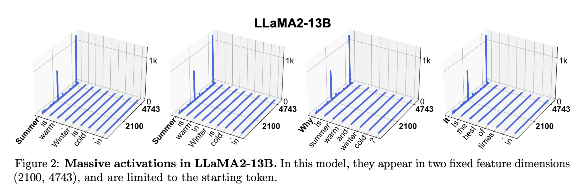

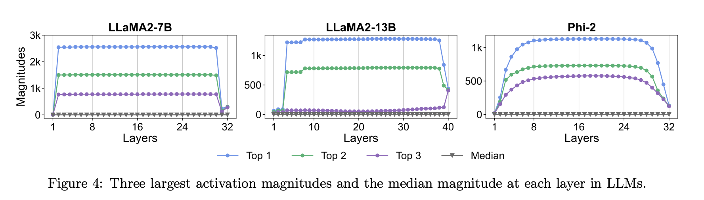

这里要注意，massive activation 和 outlier feature 并不一样，后者指的是某个 feature dimension 在很多 token 上都比较大，作者通过实验发现两个定义下找到的 token 并不重叠

本文给出了一个 massive activation 的粗略的判断方式：

1. 某个 token 的某个 activation 绝对值大于 100
1. 某个 token 的某个 activation 绝对值大于此层所有 activations 的中位数的 1000 倍

二者需要同时满足，作者说了这个不是理论定义，但是能比较稳定的找到 massive activation

### massive activations 的用处

作者发现，这些 massive activations 的大小几乎不随着输入 x 而改变，因此作者认为这很像一个 bias

在 LLaMA 7b 上针对 4 个 massive activation 进行了两个实验：

1. 将 massive activations 设置为 0：模型出现了明显的性能降级
1. 将 massive activation 设置为它们的 mean：基本没有区别

然后作者发现，massive activations 会带来 attention sink。在 attention 计算过程中，带有 massive activation 的 token 得分会略高，然后经过 softmax 后差距被放大，导致它们吸收了大部分的注意力

现代 LLM 中一般会使用 pre norm+RMSNorm，而 RMSNorm 对 outlier 很敏感，收到 massive activation 影响，非 massive activation 的 feature dimension 会被挤压到接近 0，导致这个 token 的 feature 非常稀疏，并且所有带有 massive activations 的 token 都长的差不多。因此，这些带有 massive activations 的 token 的 representation 变成接近固定的，成为了模型学习到的一个隐式的参数

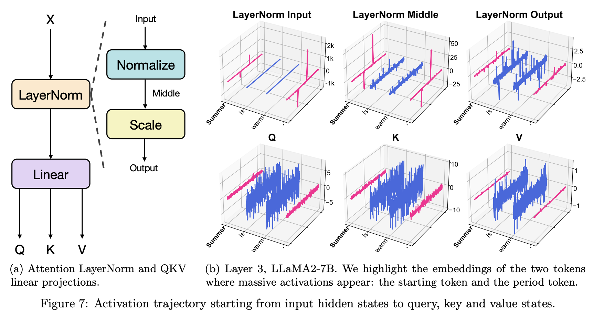

然后作者分解一个 token 经过 attention 后的输出，可以单独把来自 massive activation token 的那部分拿出来，这部分的值近似是固定的，也就成为了一个 implicit attention bias。所以 26 年的最新工作 OutRo 实际上和这篇工作高度相似，把 massive activations 包装成了 attention sink 又拿出来说了一遍

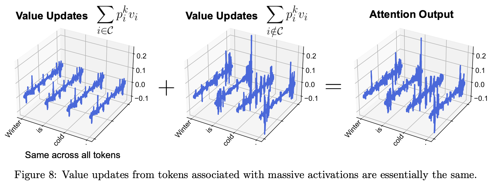

那如果我们显式的加入可学习的 KV，用来充当 bias 呢？作者进行了三组实验：

1. 普通 GPT-2：作为对照
1. GPT-2 with [SINK] token：仍然存在 massive activations
1. GPT-2 with learnable k,v for each attention head：massive activations 消失了，随着 layer 变深数值平滑提高，并且性能也并没有变化

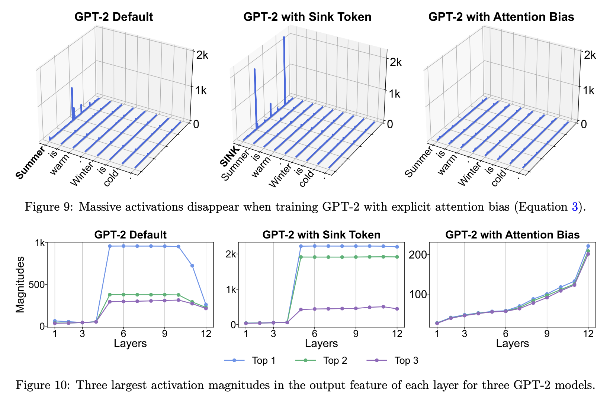

### ViT

然后作者拓展到了 ViT 中，发现 CLIP 和 DINO 中也有，但是 MAE 中没有，说明 massive activations 在 ViT 中并不是普遍现象。

不过 ViT 中的 massive activations 和 LLM 中的有一些区别：

1. 出现的比较晚
1. 发生 massive activation 的 patch token 不固定

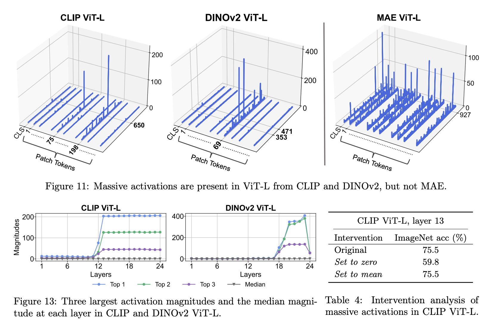

但是功能是相同的，同样是充当 bias，上图右下角可以看到实验结果，设置为 0 会让模型性能降级

之前的 ViT 工作中，提出过加入 register token 来聚合 global image information 以提升性能。作者发现加入 register 后，所有 massive activation 都跑到了 register 3 中，并且最后一层的 [CLS] 也将 attention 集中到 register 3 上，这和 LLM 中的现象高度一致

然后作者做了一个更强的干预实验，直接将所有 register 的 feature 改成了 10K ImageNet 上的平均值，结果模型性能不变，这说明 register 本质上提供了 constant bias，而非我们预想的 global image information

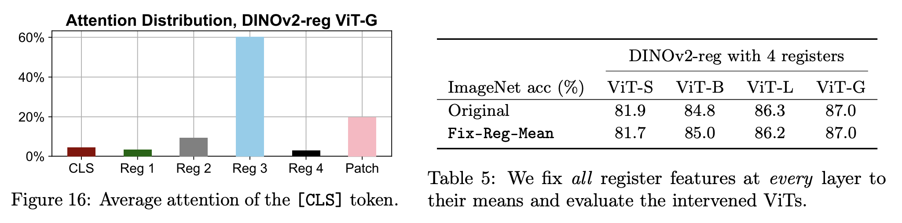

## Active-Dormant Attention Heads 2024-10

实验很复杂，结论比较简单。

1. attention sink 的本质是：attention head 进入了 dormant phase，也就是这个头在当前的输入/任务上基本没用，但是 softmax 要求 attention weights 和为 1，因此模型会把大部分 attention 放在一个 value 很小的 token 上，使得最终的 attention output 近似为 0
1. attention sink 和 value-state drain 是相关的：某个 token 的 value 越小，模型把 attention 放在它上面就越安全，而 attention 越集中在它上面，又会进一步推动其 value 变小，最终系统进入稳定状态，其中不同 query 对 sink token 的 attention 变得很大而且彼此非常接近

## When Attention Sink Emerges in Language Models: An Empirical View 2024-10

直接进入分析部分

从 massive activations 开始看，作者发现这种 token 并没有在后续形成很大的 key，但是在计算 attention 的 qk 点积时，qk 的 cosine similarity 很高，也就产生了 attention sink

然后作者还形式化定义了 attention sink：后续所有能看到 token k 的 query，平均给它多少 attention。然后设定一个阈值来评判

后续对 attention sink 从何而来的分析就没看了

## See What You Are Told 2025-03

提出 Visual Attention Sink

这篇论文主要研究 text token 到 visual token 的 attention 产生的 sink

作者首先将获得高 attention 的 visual token 分成两类：

1. relevant visual token：和当前 text token 语义相关
1. irrelevant visual token：固定出现，基本不随 text token 改变

然后作者发现，irrelevant visual token 中也有少数固定的 feature dimension 异常大，和 LLM 中的 massive activation 很像，作者记录下了这些特殊的 dimension，然后根据这个现象给出了对 visual sink token 的定义：

对于一个 token x，预先确定一些 sink dimensions，再判断每个 token 的 sink dimension 数值与 RMS（所有维度）的比值是否超过阈值（文章中设置为 20）

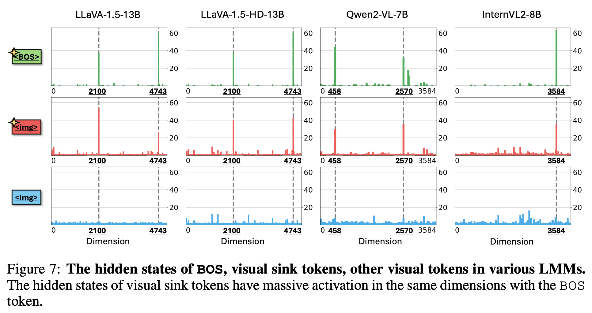

从图中可以看出，这样找出的 visual sink token 的其他维度还是比较正常的，没有像 LLM 中一样基本近似为 0

作者发现把这些 sink token 删掉也没有影响，因此就可以把汇聚在这些 token 上的 attention 重新分配到其他 token 上来提高性能表现

## To Sink or Not to Sink 2025-10

作者发现，VLM 中的 sink 现象由两部分组成：

1. ViT 传播进来的 sink
1. LLM 产生的 sink

这两类 sink 的性质不同，不能混为一谈

作者给出了 sink 的形式化定义：某个异常指标超过阈值的 token

而这个异常指标可以有多个定义：

1. feature norm
1. decoding 时，输出 token 对该 token 的平均 attention
1. massive dimension
1. 这里作者没提到，仅看 visual token 时，还有 text token 对 visual token 的平均注意力

然后是作者的选择：

1. ViT sink：使用 feature norm
1. LLM sink：使用 massive activation

然后进入实验部分，作者发现 ViT token norm 越大，在 LLM 中获得的 attention 越大，ViT 并没有规定这个规则，这是 LLM 自身学会的。并且 decoding 阶段 ViT sink 和 llm sink 获得了差不多的 attention。

接着作者发现两种 sink 的 massive dimension 并不相同，因此二者确实不是同一种 sink

然后做了两个实验来观察 ViT sink 中到底存了什么：

1. relevance map：**这里用的是 ViT 中的 attention。**观察一个 sink token 或者 non-sink token，找其他 token 给他的 attention 来画一张图，发现 non-sink token 的 relevance 基本集中在附近局部 patches，而 sink token 的 relevance 分布在很大范围，并且有的头主要聚合 foreground、有的头主要聚合 background。也就是说，non-sink token 聚合局部信息，sink token 聚合粗粒度的全局信息
1. decoding 时的 word distribution：把 attention 关了，抑制信息交换，然后看 LM Head 的 distribution 输出，发现 sink token 的 distribution 明显偏向画面主体，而 non-sink token 的 distribution 比较平滑，但是画面主体的 frequency 仍然很高

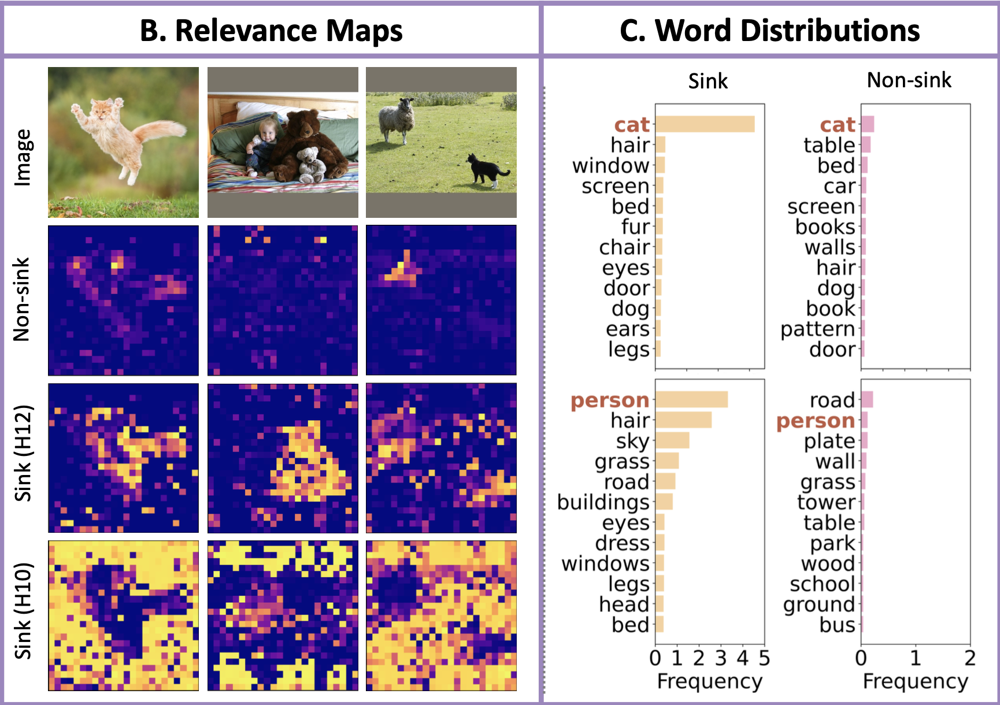

然后又做了一个更激进的实验：

1. 去掉 sink token，只保留 non-sink token：local tasks 提升性能
1. 去掉 non-sink token，只保留 sink token：global tasks 提升性能

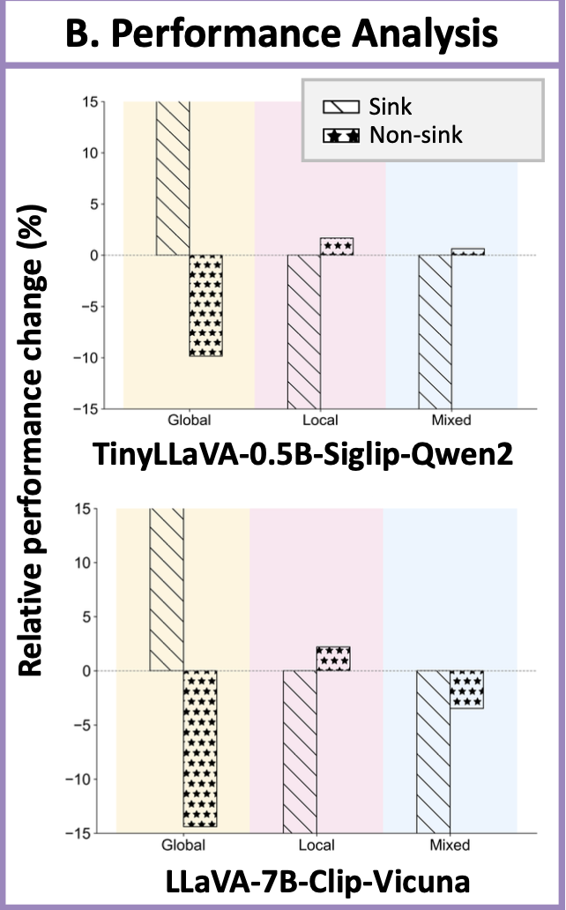

这里可以看到：

1. global 任务下，只保留 sink token 获得了巨大的性能提升，只保留 non-sink token 则是巨大的性能降级
1. local 任务下，只保留 sink token 是巨大的性能降级，而只保留 non-sink token 只获得了很小的性能提升
1. mixed 任务下，丢弃任意一种 token 都会有性能下降

### 改进

这里作者提出了两个方法：

1. training-free：Sink-to-the-front，在将 visual token 放进 LLM 时，将 sink token 提前到第一位，同时修改 position embedding。这样后续的 token 能更早的吸收 sink token 中的全局信息
1. training-based：DIYSink，visual tokens 经过 projector 进入 LLM，将这个 projector 改成 dual-mlp，分别处理 sink token 和 non-sink token。接着处理 sink token 和 non-sink token 的权重分配问题：
   1. 用 CoT 让模型自己思考并分配
   1. 再用一个单独的 mlp，只根据 text tokens 来确定 sink token 和 non-sink token 的权重，然后直接把权重加权到两类 token 的 feature 上

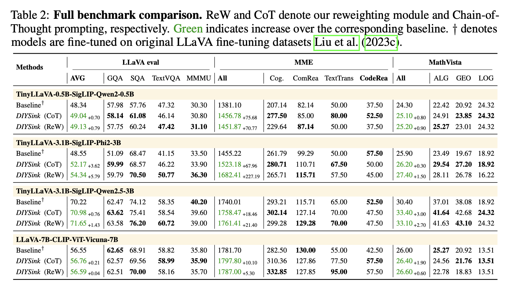

## The Spike, the Sparse and the Sink 2026-03

massive activations -> spike token：residual stream 中，少数 token 的少数 channel 上出现远超正常的 activation。起全局作用，带来一个跨层的隐藏表征，作为模型的隐参数而工作

attention sinks -> sink token：某些 token 不管重不重要，都会被大量 attention head 分配异常高的 attention mass（第一个 token，换行符等等）。起局部作用，更像是一个逐 head 的 gating 机制

二者经常同时出现，但这并不是 transformer 的内在属性，而是特定的模型架构和训练选择决定的

作者得到了 3 条核心结论：

1. normalization（pre-norm RMSNorm）在 massive activations 和 attention sinks 间起到重要作用。但通过修改 normalization，可以做到前者消失后者保留
1. attention sink 受每个 attention head 维度以及训练时上下文长度的影响
1. 两者都可以在不损害模型表现的情况下单独消除

### massive activations

1. 只存在于中间层

1. 只存在于少数 channel

1. 这些 spike channel 总是一起 spike

1. 不同 spike channel 的 magnitude ratio 几乎固定

1. 只发生在少量 token

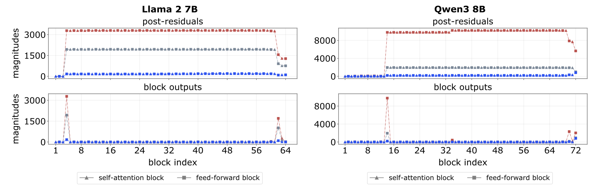

从某一层开始突然产生，通过 residual stream 传播，到最后突然消失

发现是 mlp 导致的，它们会把某些特殊的 channel 放大几个数量级。只有 token 的 representation 对准一个特殊方向时才会出发大幅放大

position 0 和 delimiter token（句号、逗号、换行）很重要，前者是位置影响的，后者是 token 本身影响的

massive activations 作为一个近似常量，主要用于给 attention 提供一个稳定的 reference 来形成 sink

### attention sink

massive activations 经过一个 RMSNorm 后，由于少数 channel 有很大的 mass，导致产生了一个接近 constant 的低维数值。当 query 普遍和这个低维数值的 k 对齐时，就产生了 attention sink

为了形成 sink head，模型必须将 non-sink key 和 sink key 拉的很开

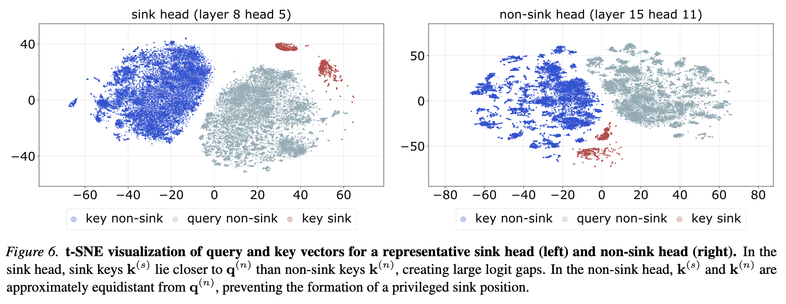

而 V 又很小，就导致最终的输出接近 0，于是 attention sink 成为模型自发学习出来的隐式 gated attention（On the Nature of Attention Sink that Shapes Decoding Strategy in Omni-LLMs 又说 V 是公共表示？？）

最后作者还发现 attention sink 是否容易形成主要取决两件事：

1. head dimension 维度越大，sink key 和 non-sink key 越容易分离
1. 训练时包含大量短 context prediction 时，模型倾向于只关注附近的上下文，其他注意力就交给 sink token 来吸收

## When sinks help or hurt 2026-04 ECCV 2026 Oral Spotlight

本文作者主要研究 Visual Token，先分类：

1. V-sink：在 vision encoder 中已经成为 sink
1. L-sink：在 ViT 输出时是普通 token，进入 LLM 后才逐渐变成 sink

然后形式化定义什么是 sink，这里选择了几个已知的 sink dimension，然后直接看 token 在这些 dimension 上的值是不是大于某个阈值，判断出 V-sink 和 L-sink 后，剩下的 token 就叫 ordinary token

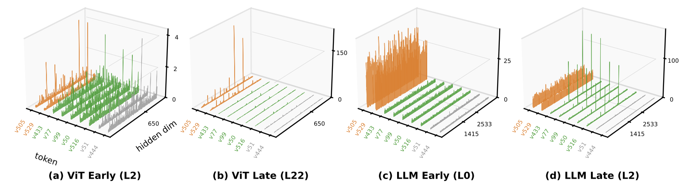

对于 V-sink，经过 projector 后 feature 发生了混合，而 L-sink 经过某个 mlp 后变成了 sink token

作者发现二者在 hidden-state norm 和 per-token attention 上都很突出，以及二者都携带了 global scene summary

然后作者继续做 attention 干预试验，控制 V-sink 和 rest 的 attention 强度，得到 3 个观察：

1. sink 的好坏和任务有关系：对于细粒度的任务，sink 是坏的，对于粗粒度的任务，sink 是好的
1. sink 的作用还和 layer 有关：同样的调节，在不同的 layer 深度上出现了截然不同的效果
1. 把 L-sink 单独拿出来调节的效果并不大，所以后面的改进中 L-sink 和 Ordinary 被划成了一类

### 改进

然后作者提出 Layer-wise Sink Gating（LSG）

作者用每层最后一个 token 的 hidden state 作为输入，用一个 mlp 来预测下一层应该多看 V-sink 还是 rest，然后直接 NTP

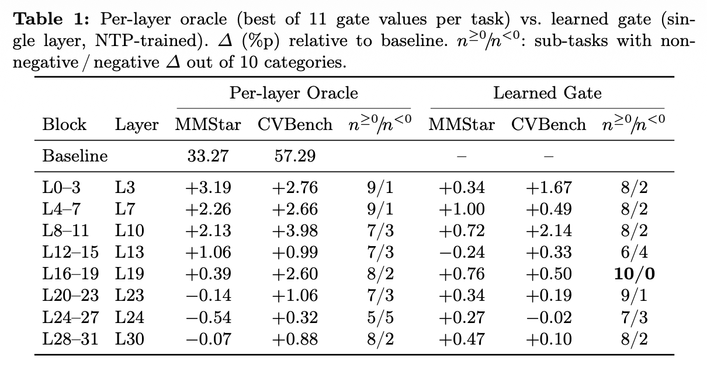

同时在多层使用单独训练的 mlp 可以叠加增益

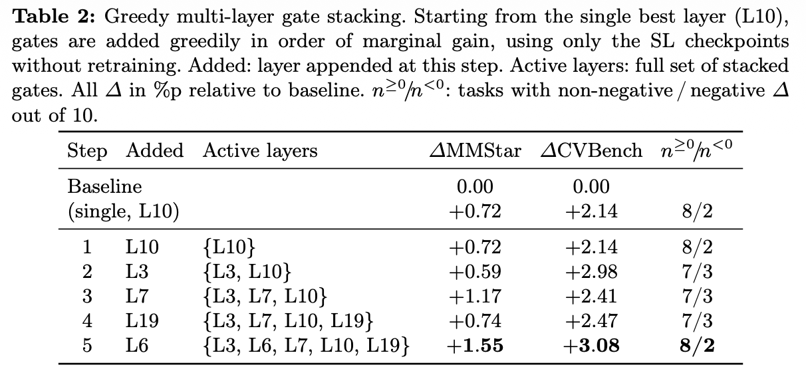

## A Unifying View of Attention Sinks 2026-06

这篇论文发现 ViT 中存在两种 sink：

1. NOP：什么都不做，v norm 需要为 0
1. Broadcast：广播信息，v 正常或较大

所以不能只看 attention weight 判断 sink 的作用，还需要看 value 和 residual update

这个工作对 attention sink 的定义是平均累积注意力大于一个阈值

然后来到实验环节，作者在真实 ViT 中找到了这两类 sink token，浅层和中间层更多的是 NOP，深层更多的是 Broadcast

然后作者想到之前的工作通过加入几个 register token 来让模型不要把正常的 patch token 拿去承担聚合全局信息的工作

然后作者在有 register token 的模型上继续实验，发现 sink mass 几乎都迁移到了 register 上，并且这些 register 的角色也不同，大部分是 NOP，小部分是 Broadcast

### 改进

于是作者提出，直接用 gating attention 取代 NOP，然后让 register token 承担 broadcast 的功能

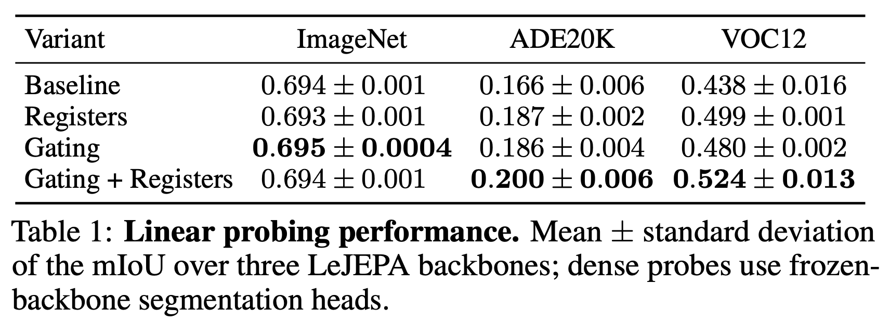

## SinkRouter 2026-04

前面的分析都是研究过的内容，NOP 小 v norm 之类

### 改进

prefilling 没动

首先用 sink 定义，某个 query head 给 BOS 的 attention 大于一个阈值就认为这是 NOP 的

但是这样工程上没法做，所以改成用 query 和 BOS key 的 cosine similarity

对于一个 KV Group，求多个 query 的平均大于一个阈值

如果大于了，就直接令 attention output 为 0

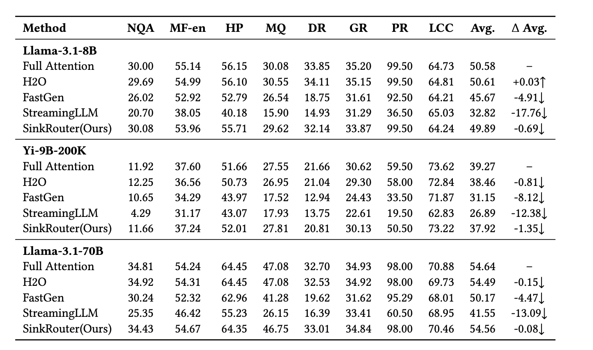

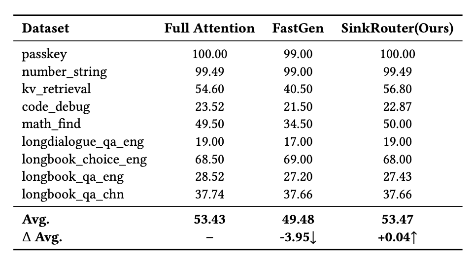

结果是做到了接近无损

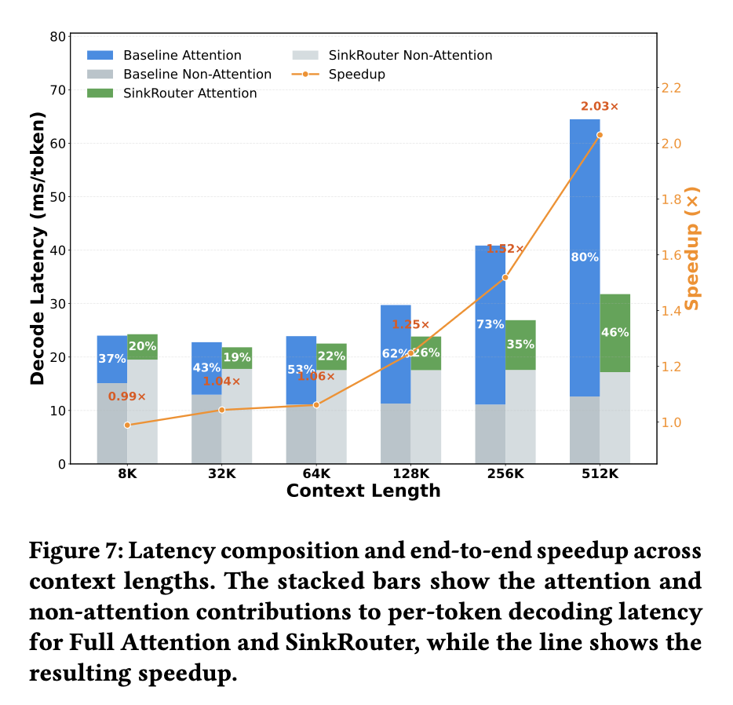

可以看到，上下文越长，加速越明显，但是比较短时基本没啥加速

## 方向

目前有很多工作都研究了 attention sink，并且发现了各种各样的作用然后加以利用，但其实它们研究的对象并不相同：

1. 研究的阶段不同：ViT、prefilling、decoding
1. detetor 不同，也就是对 attention sink 的形式化定义不同
   1. attention：某个 key/token 从许多 query 接收异常大的 softmax attention
   1. massive activations：某个 token 的少数 feature 跨数量级的大
   1. high norm：整个 token feature vector 的范数异常大
1. detector 找到的 token，还能继续细分，以 attention 为例
   1. v norm 低的，作为 NOP
   1. v norm 高的，聚合全局信息
