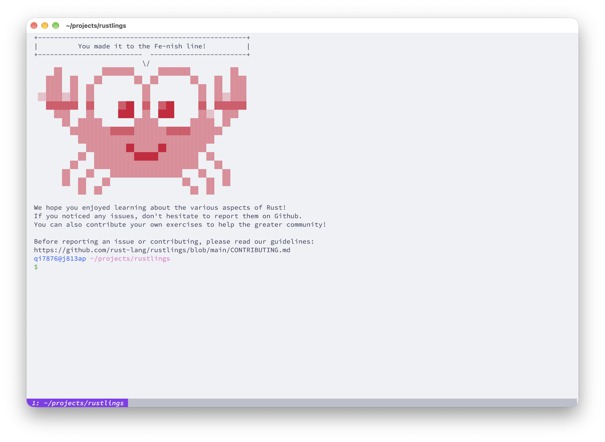

经过两三年的探索，大概知道了自己的方向：Multimodal LLMs, Agentic AI, and ML Systems

中间的心酸旧事就不再提了

然后反思了一下自身的状态：对计算机系统、深度学习系统一知半解，没有形成完整的系统思维，实践和工程能力一般。在这种状态下，当然可以继续做科研，用 Agent 水出一些东西，但不该这样，没什么意义。这个时代不缺 slop，没有好的 taste 的工作比比皆是，如果我就靠水论文度过接下来的几年，然后找个差不多的工作，继续水，那我感觉这样的人生没什么意思。

所以，决定在博士入学前完整系统的补全知识体系，计划放在文末。

## ????-??

已经想不起来我具体是什么时候学了这些

计算机通识：大一上自己摸索，因为初中后就接触过 python，配合着 ChatGPT 上手还是很快的，这个时期主要在折腾网络、linux 服务器这些东西

李沐的 Deep Learning 书：大概是大一下，只学了一部分

missing semester：大一下的暑假

吴恩达的 AI 系列：大二下，只学了部分课程

CS61A：什么时候开始学已经想不起来了，貌似是大二上

CTF：大二上

单片机：大一下的工创，顺便实践了 C 语言

计算机网络：似乎是大二下，惭愧没有认真听讲，但是实验还是认真做了，后面有时间了再补

数据库系统实验：非常惭愧，老师是工业界出来的，工程能力很强，但是我又没好好听课，项目也是糊弄的

操作系统：大三上，惭愧没有认真听讲，实验也没认真做，拿 AI 糊弄过去了，后面有时间了再补

还有一些零零散散的内容，比如 C 语言等等

## 2026-06

学完了 CS106L，感受是 C++ 的历史包袱实在是太重了

准备学习 CSAPP，看了 intro

开始准备夏令营

## 2026-07

继续忙夏令营，顺便在北京玩了几天

然后开始 nips 的 rebuttal，结束后继续学 CS61A

## 2026-08

结束了 CS61A，前前后后学了 2 年，终于断断续续的学完了

回家继续推进科研，然后度过最后 10 来天暑假假期

## 2026-09

学了目前软件工程的一些实践，日常多用用吧，不过有些最佳实践也有很多批评的声音，还是得灵活一点。

24 号，the book 看到第 17 章了，加油，争取国庆前结束吧，把 final project 做了然后开始准备软工实验，后面就专注 CS61B 和 CSAPP

25 号早晨 nips 出结果，没中，难受了一天，不想工作，痛定思痛。AC 你做人真的可以的，你做过 benchmark 不，最近几年的工作有几个给了 IAA，我做的是 Open ended 问题你告诉我怎么给 IAA，4 分 5 分审稿人一笔带过，2 分 AI 审稿哥有事实错误，你就要看就要信，自己没脑子是不是，你真做过 benchmark 能看不出来他说的是垃圾？rebuttal 里所有问题都解释了，2 分哥从头到尾连个回复都没有，最后 final meta review 说没解决 concern，我祝你全家长寿幸福安康啊。

29 号，the book 看到第 20 章了，最长信息量也最大的一章，加油，然后今天调整了一下计划清单

## 2026-10

1 号，the book 还剩最后一小节就到了 final project，然后又调整了一下课程清单

the book 的正文部分结束了！rustlings也同步做完了！开启最后的 project！

2 号，结束了 the book，开始做上周 CS61B 的作业

3 号，状态不是很好，整理了一些资料，然后推进了点 CS61B

4 号，出去爬山了

5 号，CS61B 同步进度了，今天还尝试了使用 Jujustu colocated with Git，真的太好用了，比 Git 的 mental model 要简单很多（Git 的 stash 机制很反人类，staging area / index 也同样有些多余，jj 直接让 commit 作为 workspace，消除了这些复杂度），概念上也消除了 Git 瞎起名带来的误解（比如 branch，实际上只是个 reference，Git 使用 branch 让人很容易误解成是从 main 分叉出的一整条 commit 链，而在 jj 中，作者使用 bookmark 来指代）

## Plan

- 大四上
  - [ ] !!! CS61B
  - [ ] !!! CSAPP Part 1
  - [x] ! The rust programming language
  - [ ] !! 软件工程实验课
- 寒假
  - [ ] !!! CSAPP Part 2
  - [ ] !!! CS336
  - [ ] !! OSTEP/xv6
- 大四下 + Gap Summer
  - [ ] !!! CS149
  - [ ] !!! MIT 6.5840
  - [ ] !! PMPP
  - [ ] !! Modern GPU Programming For MLSys
  - [ ] ! GPU Mode